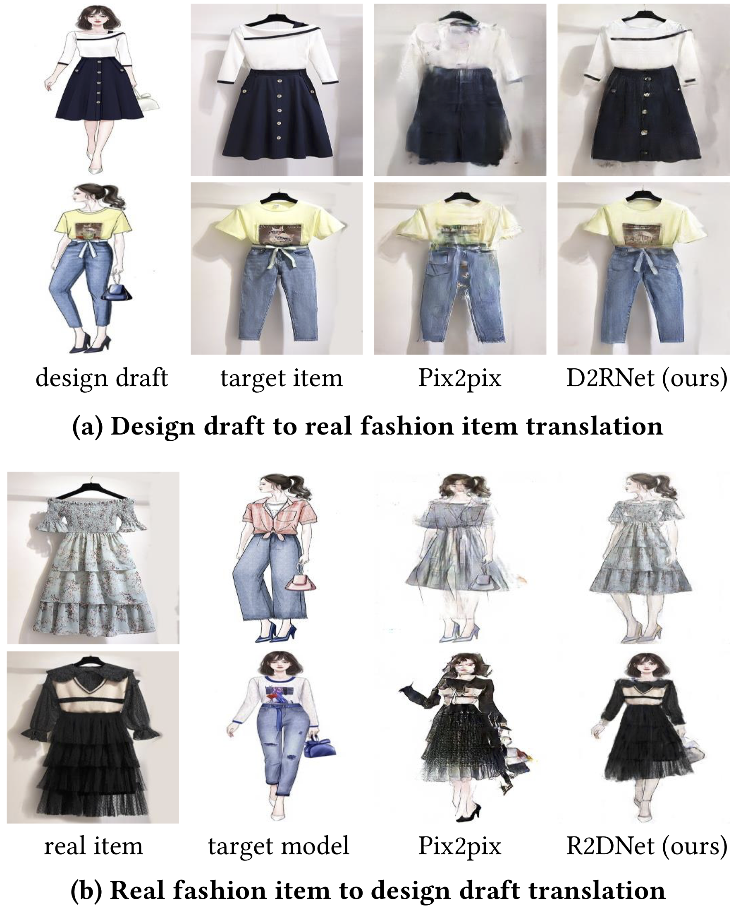

# About Me

Hi, I'm Yu Han (韩昱), an undergraduate student majoring in computer science at Peking University, Beijing, P.R.China. 

I also work as an intern student in [STRUCT], guided by Professor [Jiaying Liu]. 

I'm interested in Computer Vision and Image Generation.

[STRUCT]:http://39.96.165.147/struct.html
[Jiaying Liu]:http://39.96.165.147/people/liujiaying.html

# Contact Me

## EMail
vickyhan@pku.edu.cn

# Publication

<table>
<tr>
<td style="width: 20%">
  

  
  

  </td>
  <td style="width: 70%;">
  

  

   From Design Draft to Real Attire: Unaligned Fashion Image Translation
   

   

   <strong>Yu Han</strong>, Shuai Yang, Wenjing Wang Jiaying Liu
   

   

   ACM Multi Media. 2020.
   

   

   <a href="https://victoriahy.github.io/MM2020/">[Project]</a>
   <a href="https://arxiv.org/abs/2008.01023">[Paper]</a>
   

   

   </td>
   </tr>
 </table>
